# ISC-NIRScan-Windows-BLE

## Application Download
[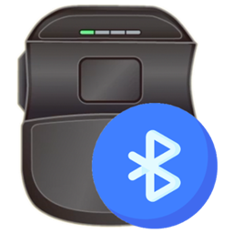 Get the App on Microsoft Store](https://apps.microsoft.com/detail/9nqwqpfjbmj9)

## Touring
### Scenario #1
Click "Start Enumerating" to find the ISC scanners 
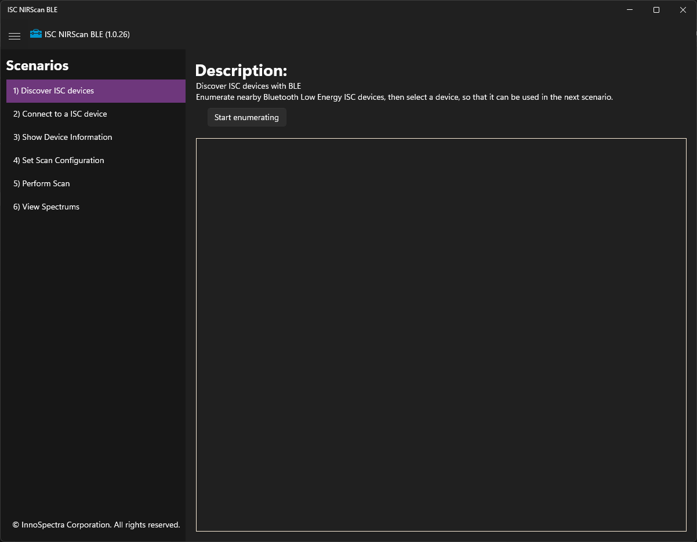  
Select the scanner and click scenario #2 
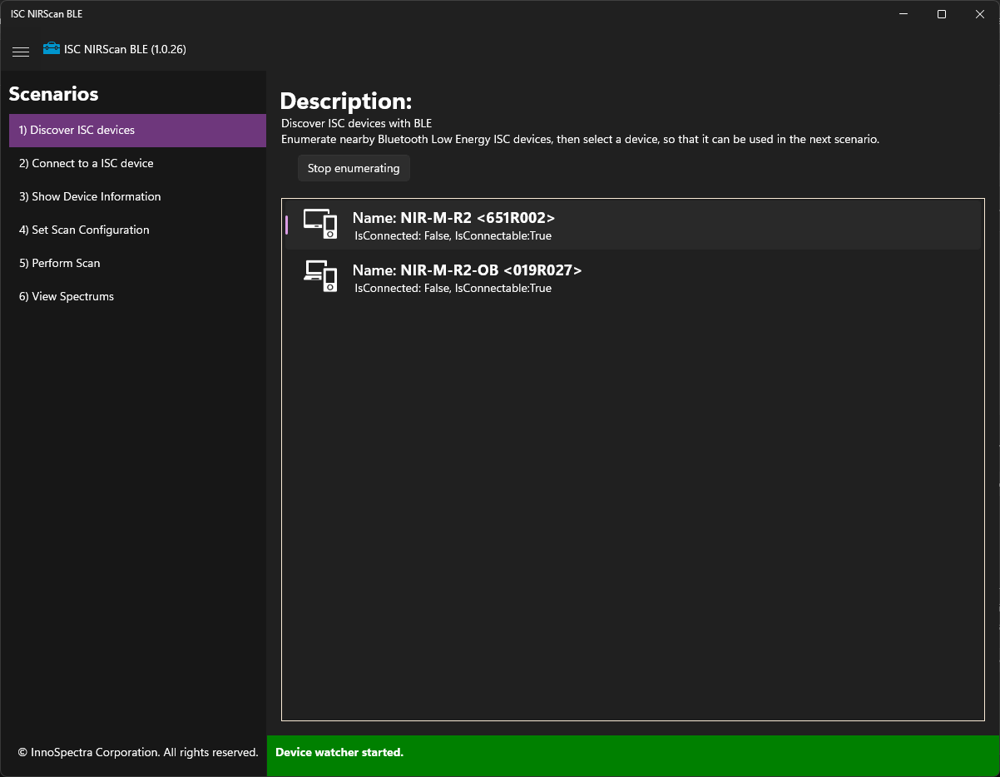  

### Scenario #2
Click "Connect" to connect the selected scanner 
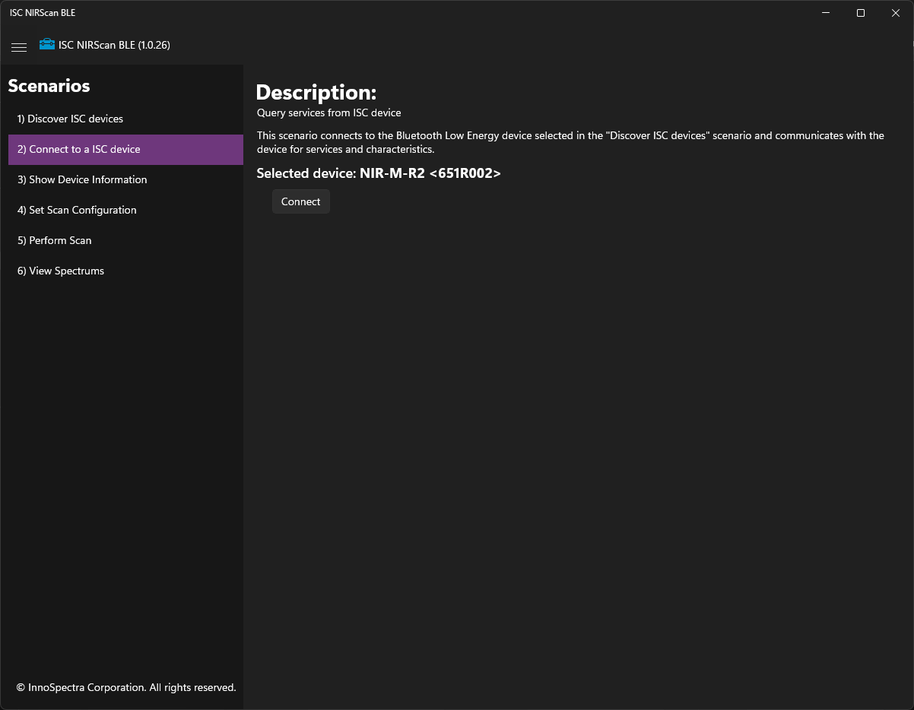  
Wait for discovering the services and characteristics 
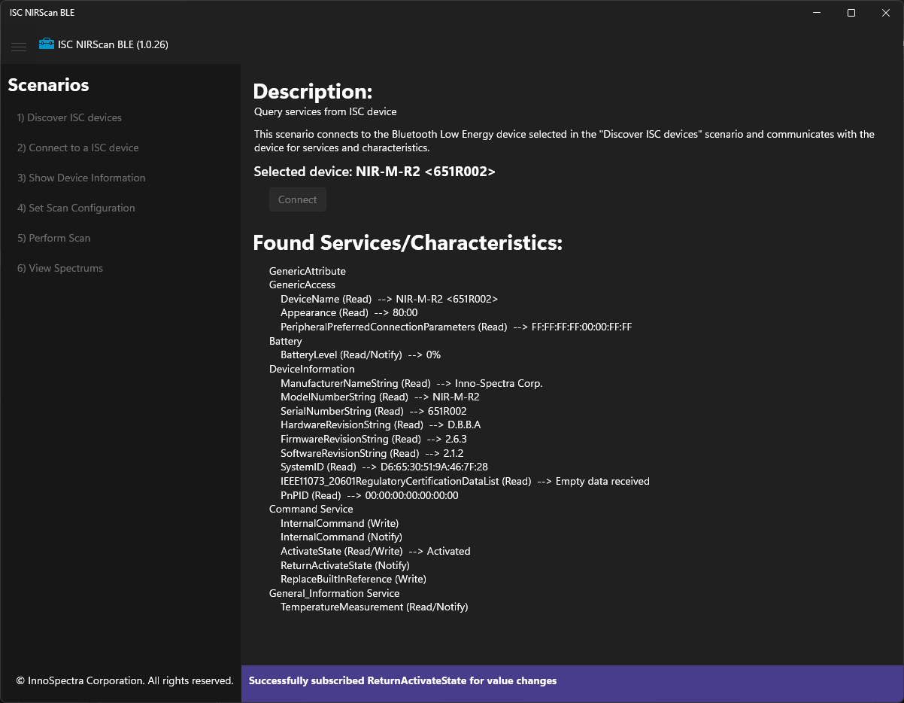  
Click scenario #3 after discovering completed 
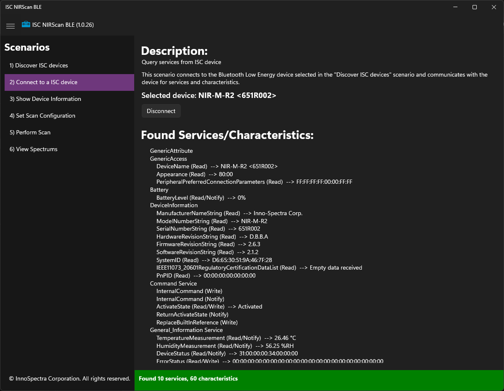  

### Scenario #3
In this scenario you can see the device information. Click "Refresh" to retrieve again if needed. 
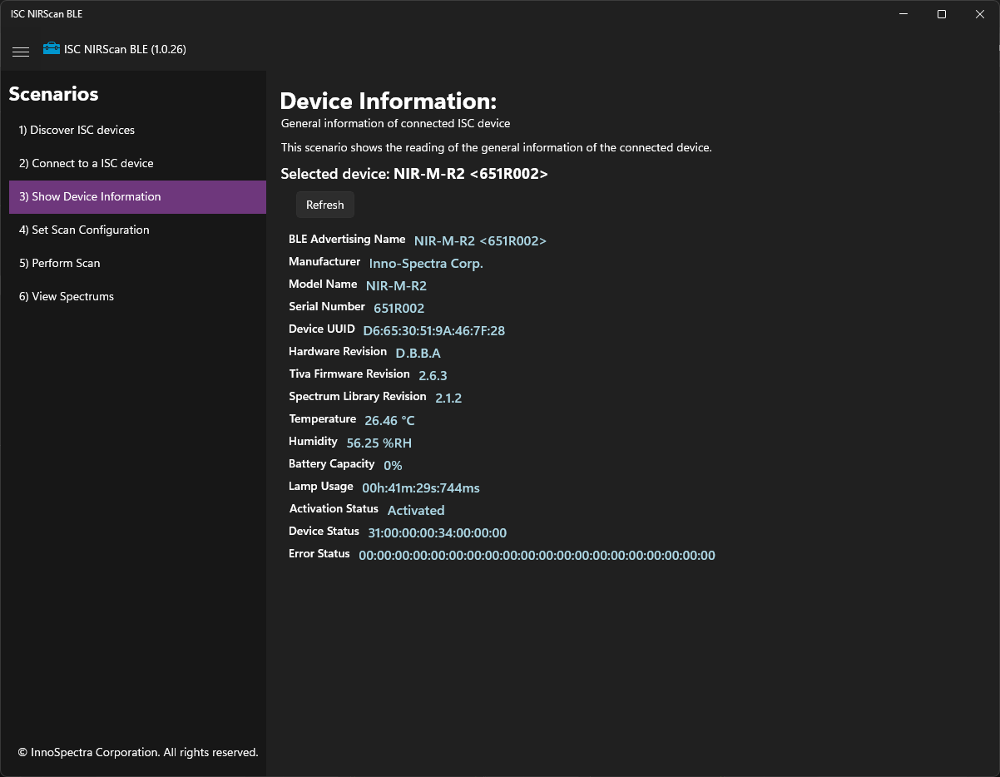  

### Scenario #4 - Select scan configuration
You can select the scan configuration from the list from the scanner's memory by the pull-down list box. Click "Apply for default/active scan config" to take effective if you change the scan configuration. 
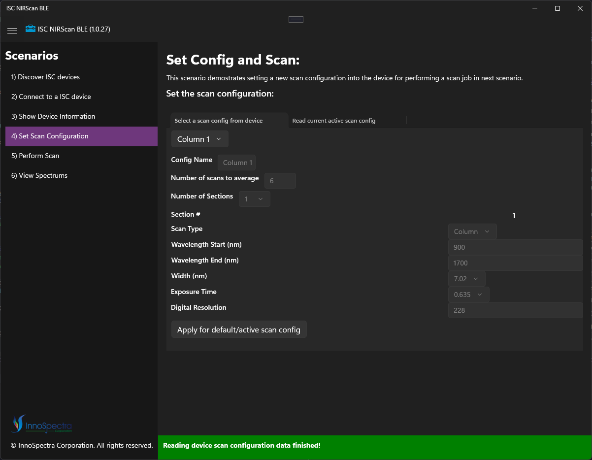  

### Scenario #4 - Get current active scan configuration
You can get the current active scan configuration from scanner by tapping this tab. 
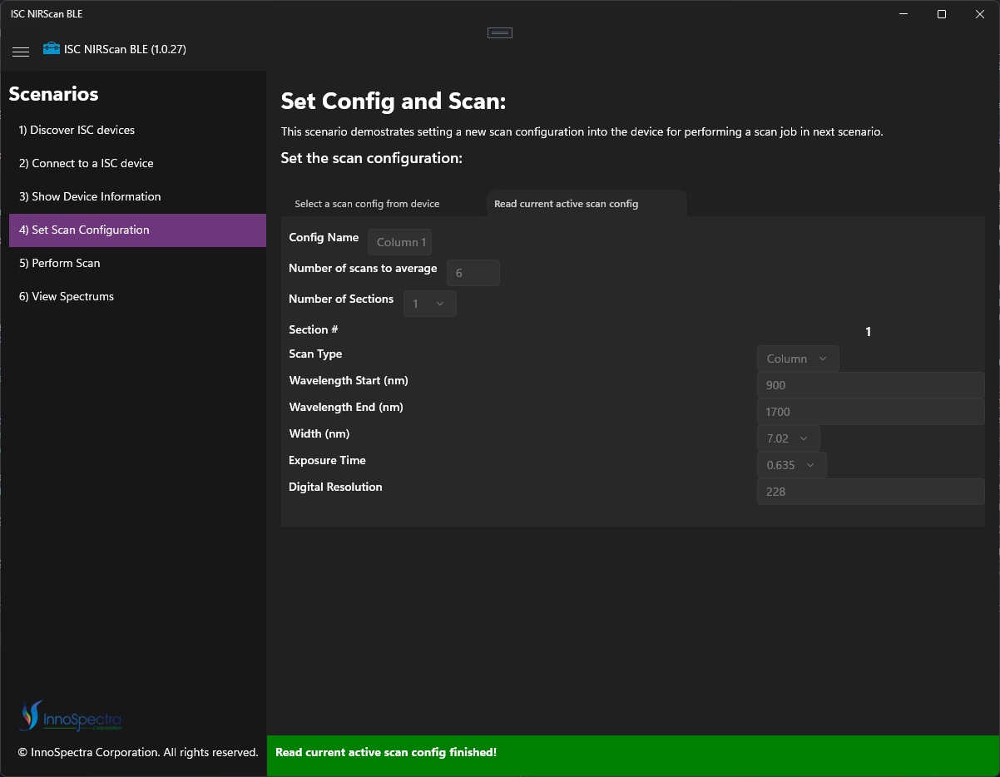  

### Scenario #5
You can do the scan by selecting New / Previous (if you did the New already) / Built-in. 
We suggest you should move out or make a copy of your scan reports from the App's data folder. 
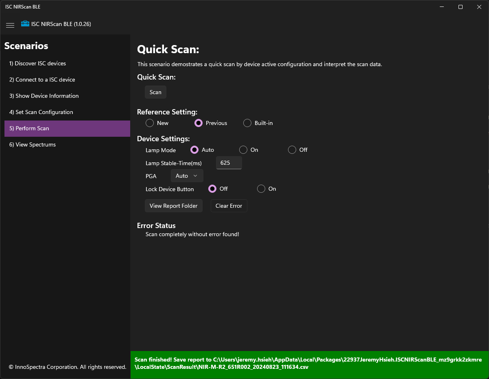  

### Scenario #6
Check the scan data by selecting the plot type. 
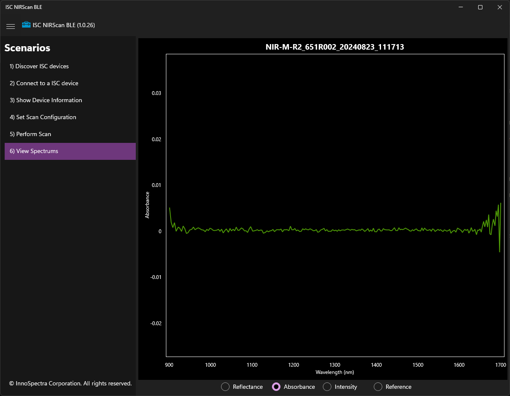  
